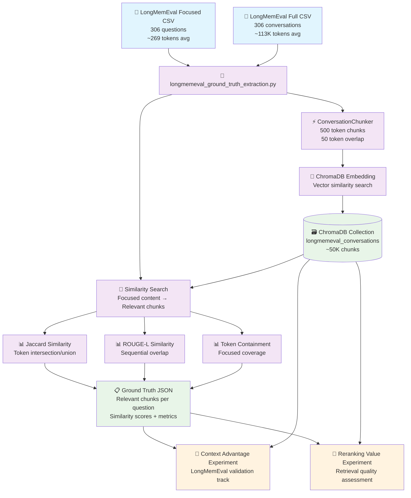

# LongMemEval Processing Flow & Experiment Integration

## Overview
The LongMemEval ground truth extraction creates the foundation for both the **Context Advantage** and **Reranking Value** experiments by establishing reliable chunk-level relevance annotations.

## Processing Flow Diagram



## Step-by-Step Process

### 1. **Data Preparation**
```bash
# Ensure LongMemEval datasets are available
data/LongMemEval/cleaned_longmemeval_s_focused.csv   # Relevant sections only
data/LongMemEval/cleaned_longmemeval_s_full.csv      # Complete conversations
```

### 2. **Ground Truth Extraction**
```bash
# Run LongMemEval-specific ground truth extraction
python scripts/longmemeval_ground_truth_extraction.py

# Or with custom parameters
python scripts/longmemeval_ground_truth_extraction.py \
    --similarity-threshold 0.65 \
    --primary-metric jaccard \
    --max-chunks 5
```

### 3. **ChromaDB Ingestion Process**
- **Chunking**: Full conversations → 500-token overlapping chunks
- **Embedding**: Each chunk gets vector representation
- **Storage**: ~50,000 chunks stored in `longmemeval_conversations` collection
- **Indexing**: Optimized for similarity search by conversation ID

### 4. **Similarity Matching**
- **Query**: Each focused content as search query
- **Scope**: Search only within same conversation (custom_id filter)
- **Ranking**: ChromaDB cosine similarity + content overlap metrics
- **Filtering**: Threshold-based relevance determination (default: 0.65)

### 5. **Output Generation**
```json
{
  "metadata": {
    "dataset": "LongMemEval",
    "similarity_threshold": 0.65,
    "primary_metric": "jaccard"
  },
  "questions": [
    {
      "custom_id": "0a995998",
      "question": "How many items...",
      "relevant_chunks": [
        {
          "chunk_id": "0a995998_chunk_7",
          "primary_score": 0.78,
          "overlap_metrics": {
            "jaccard_similarity": 0.78,
            "rouge_l_similarity": 0.65,
            "token_containment": 0.82
          }
        }
      ]
    }
  ]
}
```

## Integration with Experiments

### **Context Advantage Experiment**
```python
# Uses ground truth for LongMemEval validation track
from context_is_king.datasets.longmemeval import GroundTruthExtractor

# Load existing ground truth
with open('data/longmemeval_ground_truth.json') as f:
    ground_truth = json.load(f)

# Validate context window performance against known relevant chunks
for question in ground_truth['questions']:
    relevant_chunks = question['relevant_chunks']
    # Test different context window sizes against these chunks
```

### **Reranking Value Experiment**
```python
# Uses ground truth for retrieval quality assessment
from experiments.reranking_value.retrieval_quality import RetrievalQualityEvaluator

# Import ground truth annotations
evaluator = RetrievalQualityEvaluator()
evaluator.load_longmemeval_ground_truth('data/longmemeval_ground_truth.json')

# Evaluate retrieval approaches against ground truth
for approach in ['basic_rag', 'enhanced_rag', 'reranking']:
    retrieval_results = run_retrieval_approach(approach, questions)
    quality_metrics = evaluator.evaluate(retrieval_results, ground_truth)
```

## File Dependencies

### **Input Files** (Required)
- `data/LongMemEval/cleaned_longmemeval_s_focused.csv`
- `data/LongMemEval/cleaned_longmemeval_s_full.csv`

### **Generated Files** (Output)
- `data/longmemeval_ground_truth.json` - Ground truth annotations
- `chroma_longmemeval/` - ChromaDB collection directory

### **Experiment Integration**
- **Both experiments** can use the same ground truth file
- **ChromaDB collection** persists for repeated similarity searches
- **Modular design** allows experiments to load only what they need

## Key Benefits

1. **Single Source of Truth**: One ground truth extraction serves both experiments
2. **Efficient Storage**: ChromaDB collection persists across runs
3. **Flexible Metrics**: Jaccard (simple) + ROUGE-L (conversation-aware) options
4. **Validated Relevance**: Human-curated focused content ensures quality
5. **Scalable**: Handles all 306 LongMemEval questions efficiently

## Usage Commands

```bash
# 1. Extract ground truth (one-time setup)
python scripts/longmemeval_ground_truth_extraction.py

# 2. Run Context Advantage experiment with LongMemEval validation
python experiments/context_advantage/context_advantage_experiment.py \
    --experiment-type longmemeval

# 3. Run Reranking Value experiment with retrieval quality assessment
python experiments/reranking_value/run_experiment.py \
    --use-ground-truth data/longmemeval_ground_truth.json
```

The ground truth extraction is the **foundational step** that enables both experiments to have reliable, human-validated relevance judgments for proper evaluation.