<!-- 

## Research question:
- When must we switch from context window retrieval to RAG
- Can we skip RAG and immediately work with full context window when sources fit in the context window? 
- Is there a context window threshold where we observe a sharp dropoff in performance?
- Does reranking still make sense in a post-RAG world? 
- If small context is still needed, and reranking does not help, how can we best utilize the effective context window?
- With growing context windows, how does the performance of RAG change when we start to include more retrieved chunks?
- Do models with larger context windows outperform models with smaller context windows at the same context window size. For example, does a 1M token context window perform better than a 100k token context window at the 100k token context window size?
- Chroma research indicates that shuffling data improves retrieval performance within the context window. If this is the case, should we start shuffling data for context-window retrieval?

### Cost-performance trade-off
- At what cost multiplier does RAG become preferable regardless of performance?
- Does cost-performance trade-off change with context window size?

### Latency implications
- How does latency change with context window size?
- What are the latency thresholds where RAG becomes necessary for user experience?

### Dynamic context management: (optional)
- How should systems adaptively choose between RAG and long context based on query characteristics?
- Can we develop hybrid approaches that use long context for certain queries, and RAG for others?

### Hybrid Approach Optimization (out of scope)

- What are the optimal hybrid strategies that combine RAG with selective long context usage?
- How should we partition information between immediate context and retrieval corpus in hybrid systems?

## Hypothesis

1. Long context allows us to skip RAG for certain situations that easily fit into context window
2. There is some context windows threshold where we observe a sharp dropoff in performance.
3. Reranking does not hold value for long context windows, except when using reranker thresholds as filtering mechanism.
4. Cost-adjusted performance favors RAG even when long context technically performs better, with the crossover point occurring at [X]% context window utilization.
5. Hybrid approaches that strategically combine RAG with selective long context usage outperform pure strategies across most practical scenarios.
6. The optimal context strategy is predictable from document corpus characteristics, enabling automated strategy selection.

## Experiment setup
We have results from context window retrieval. We will re-use the same datasets as chroma has done in their research, with common best practices. 

## Notable points
- Llama has a 10M model, but it's only served up to 128k. Together AI serves Scout up to 1M (10% of max), openrouter also 1M max.
- Google reduced the max context size window from 2M back to 1M for Gemini 2.5. What does this tell us?


## Evaluation Metrics
- Beyond accuracy, include:
  - Cost per query (normalized across approaches)
  - End-to-end latency
  - Memory utilization

ABN AMRO annual report is 500k tokens. -->


```{=html}
<div style="text-align: center;">
  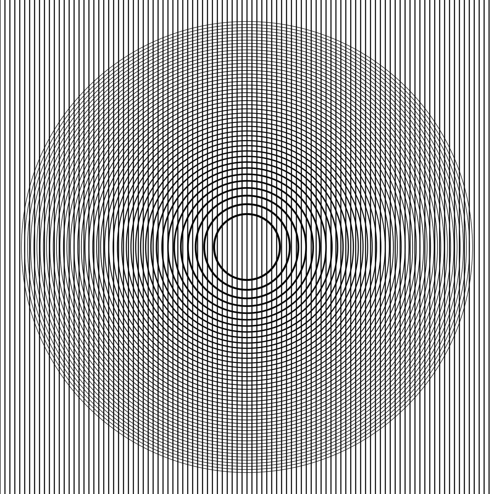
  <h1 style="margin-top: 2rem;">Context is King</h1>
</div>
```

---

## Your RAG Pipeline is Probably Overkill {.center}

---

## The Problem That Started It All {.center}

**ESG Analysis at a bank**: Extract emissions data from annual reports

:::{.fragment .fade-in}
**Traditional RAG kept failing**:

- Missing critical cross-referenced information
- No standard ESG jargon across companies
- No good ground truth dataset
:::

:::{.fragment .fade-in}
**The question**: *With more than 1M token context windows, do we even need RAG?*
:::

:::{.notes}
This was the start of my 
:::

---

## Why This Matters to You {.center}

:::{.fragment .fade-in}
**RAG is expensive** - infrastructure, embedding models, vector databases
:::

:::{.fragment .fade-in}
**Context windows are growing** - from 4k to 1M+ tokens in 2 years
:::

:::{.fragment .fade-in}
**But performance trade-offs are unclear** - when should you make the switch?
:::


# Who am I

```{=html}
<div style="display: flex; justify-content: space-between; align-items: center; width: 100%;">
  <!-- Left side: Bio information -->
  <div style="width: 60%; background: linear-gradient(135deg, #073642, #002b36); border-radius: 15px; padding: 25px; box-shadow: 0 6px 15px rgba(0,0,0,0.3);">
    <h3 style="color: #2aa198; margin-top: 0; margin-bottom: 10px; font-size: 1.5em;">Bauke Brenninkmeijer</h3>
    <ul style="list-style-type: none; padding-left: 0; color: #eee8d5;">
      <li style="margin-bottom: 12px; display: flex; align-items: center;">
        <span style="color: #b58900; font-weight: bold; margin-right: 10px;">✓</span> Research Engineer @ orq.ai
      </li>
      <li style="margin-bottom: 12px; display: flex; align-items: center;">
        <span style="color: #b58900; font-weight: bold; margin-right: 10px;">✓</span> CS @ Radboud University
      </li>
      <li style="margin-bottom: 12px; display: flex; align-items: center;">
        <span style="color: #b58900; font-weight: bold; margin-right: 10px;">✓</span> 6 Years Data Science @ABN AMRO & @ING
      </li>
      <li style="display: flex; align-items: center;">
        <span style="color: #b58900; font-weight: bold; margin-right: 10px;">✓</span> Organiser @ MLOps Community Amsterdam
      </li>
    </ul>
  </div>

  <!-- Right side: Headshot -->
  <div style="width: 35%; height: 300px; background: linear-gradient(135deg, #fdf6e3, #eee8d5); border-radius: 15px; display: flex; justify-content: center; align-items: center; box-shadow: 0 6px 15px rgba(0,0,0,0.3);">
    <div style="color: #586e75; font-size: 1.2em; text-align: center;">
          
    </div>
  </div>
</div>
```

::: {.fragment .fade-up}
```{=html}
<div style="
  position: absolute;
  top: -400px;
  left: 10%;
  width: 400px;
  height: 450px;
  z-index: 1000;
  border-radius: 10px;
  padding: 15px;
  text-align: center;
">
  
  <p style="margin-top: 15px; color: #2aa198; font-weight: bold; font-size: 1.1em;">Chief Vibe Officer</br>Demetrios Brinkmann</p>
</div>
```
:::

::: {.fragment .fade-up}
```{=html}
<div style="
  position: absolute;
  top: -400px;
  right: 10%;
  width: 300px;
  height: 450px;
  z-index: 1000;
  border-radius: 10px;
  padding: 15px;
  text-align: center;
">
  
  <p style="margin-top: 15px; color: #2aa198; font-weight: bold; font-size: 1.1em;">Florenz Hollebrandse</p>
</div>
```
:::

<!-- ---

## What We'll Show Today {.center}

:::{.fragment .fade-in}
**1.** When to skip RAG entirely (spoiler: more often than you think)
:::

:::{.fragment .fade-in}
**2.** The 100k token performance cliff
:::

:::{.fragment .fade-in}
**3.** Why reranking is dead for modern LLMs
:::

:::{}
Cost-Performance Trade-offs
:::

:::{.fragment .fade-in}
**4.** A practical decision framework for your Monday morning
::: -->

---

## The Questions We Will Answer {.center}

:::{.fragment .fade-in}
**1. How fast are LLMs?**
:::

:::{.fragment .fade-in}
**2. When to skip RAG entirely?**
:::

:::{.fragment .fade-in}
**3. Where's the performance cliff?**
:::

:::{.fragment .fade-in}
**4. Is reranking dead?**
:::

:::{.fragment .fade-in}
**5. Is long context worth it?**
:::

---

## Why: 6 Months of RAG optimization{.center}

• Started with 60% accuracy on ESG extraction

:::{.fragment}
• Added query rewriting → 65%
:::
:::{.fragment}
• Added reranking → 68%
:::
:::{.fragment}
• Added hybrid search → 70%
:::

</br>

:::{.fragment}
:::{.callout-important}
What if we put the whole document in the context window? **85%?!**
:::
:::

:::{.notes}
:::

--- 

## The RAG Complexity Trap{.center}

:::{.fragment}
- Every improvement adds complexity
:::
:::{.fragment}
- More components = more failure points
:::
:::{.fragment}
- Chunking destroys cross-references
:::

:::{.notes}
What is the solution is simpler, not more complex? 
:::

---

## The Context Window Promise {.center}

:::{.fragment}
- No chunking = no lost cross references
:::
:::{.fragment}
- No retrieval = no missing information
:::
:::{.fragment}
- No embedding = full representation
:::

---

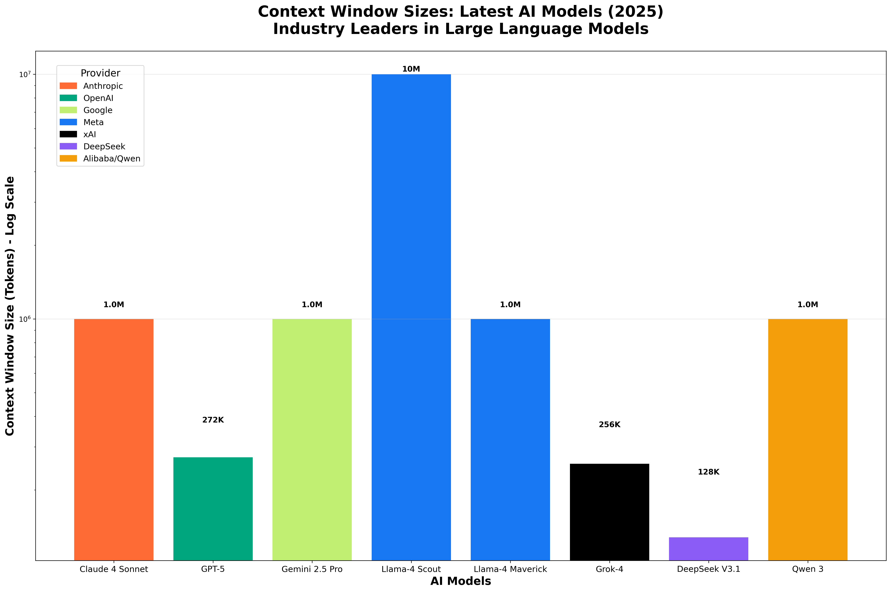{fig-align="center" width=90%}

---

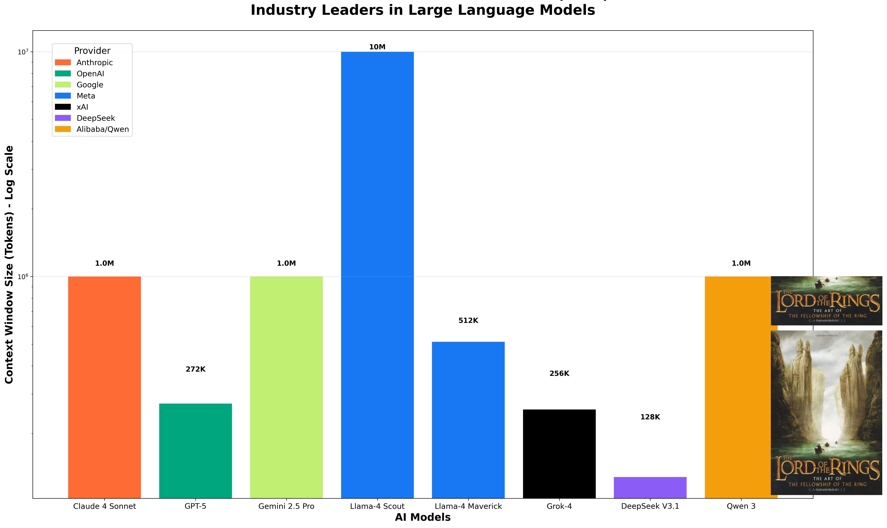{fig-align="center" width=90%}

<!-- :::{style="text-align:center;color:lightgrey;"}
Poor Analysists
::: -->

---

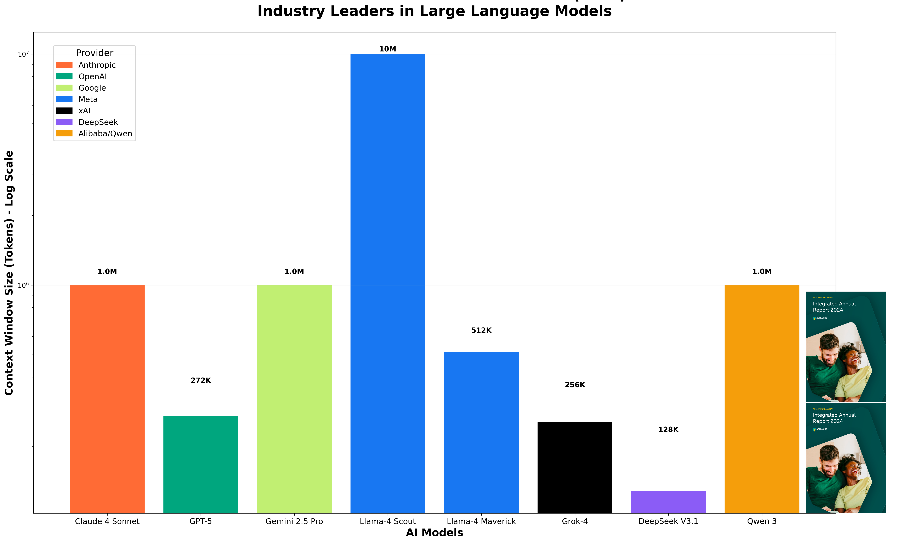{fig-align="center" width=90%}

:::{.fragment .fade-up style="text-align:center;"}
So we can fit a lot. 
:::


<!-- ---

## Who are the biggest users? {.center style="text-align: center;"}

:::{.fragment .fade-in style="text-align: center;"}
Coding Agents
::: -->


## Claude Code <3 {.center}

---


## CC is no magic{.center}

```{=html}
<div style="display: flex; justify-content: space-around; align-items: center; width: 100%; margin: 40px 0;">
  <!-- Research Plan -->
  <div style="text-align: center; width: 30%;">
    <div style="font-size: 4em; margin-bottom: 15px;">📋</div>
    <p style="color: #2aa198; font-weight: bold; font-size: 1.2em; margin: 0;">Research Plan</p>
  </div>

  <!-- Experiments -->
  <div style="text-align: center; width: 30%;">
    <div style="font-size: 4em; margin-bottom: 15px;">🧪</div>
    <p style="color: #2aa198; font-weight: bold; font-size: 1.2em; margin: 0;">Experiments</p>
  </div>

  <!-- Claude Code Max -->
  <div style="text-align: center; width: 30%;">
    <div style="font-size: 4em; margin-bottom: 15px;">🤖</div>
    <p style="color: #2aa198; font-weight: bold; font-size: 1.2em; margin: 0;">Claude Code Max</p>
    <!-- <p style="color: #93a1a1; font-size: 0.9em; margin: 5px 0 0 0;">$100/month</p> -->
  </div>
</div>
```

:::{.fragment .fade-in style="text-align: center; margin-top: 40px;"}
**AI goes Brrrrr!?**
:::

---

## The Chaos That Followed{.center}

```{=html}
<div style="display: grid; grid-template-columns: 1fr 1fr; grid-template-rows: 1fr 1fr; gap: 30px; margin: 40px 0; max-width: 960px; margin-left: auto; margin-right: auto;">
  <!-- Top Left -->
  <div style="display: flex; align-items: center; padding: 20px; background: rgba(220, 50, 47, 0.1); border-left: 4px solid #dc322f; border-radius: 10px;">
    <div style="font-size: 2.4em; margin-right: 20px;">🔄</div>
    <p style="margin: 0; color: #dc322f; font-weight: bold; font-size: 0.88em;">Checkpoint system starts over</p>
  </div>

  <!-- Top Right -->
  <div style="display: flex; align-items: center; padding: 20px; background: rgba(220, 50, 47, 0.1); border-left: 4px solid #dc322f; border-radius: 10px;">
    <div style="font-size: 2.4em; margin-right: 20px;">📄</div>
    <p style="margin: 0; color: #dc322f; font-weight: bold; font-size: 0.88em;">Creates endless new files</p>
  </div>

  <!-- Bottom Left -->
  <div style="display: flex; align-items: center; padding: 20px; background: rgba(220, 50, 47, 0.1); border-left: 4px solid #dc322f; border-radius: 10px;">
    <div style="font-size: 2.4em; margin-right: 20px;">🔗</div>
    <p style="margin: 0; color: #dc322f; font-weight: bold; font-size: 0.88em;">Ignores updated functions</p>
  </div>

  <!-- Bottom Right -->
  <div style="display: flex; align-items: center; padding: 20px; background: rgba(220, 50, 47, 0.1); border-left: 4px solid #dc322f; border-radius: 10px;">
    <div style="font-size: 2.4em; margin-right: 20px;">💥</div>
    <p style="margin: 0; color: #dc322f; font-weight: bold; font-size: 0.88em;">Hundreds of files everywhere</p>
  </div>
</div>
```

:::{.fragment .fade-in style="text-align: center; margin-top: 30px;"}
```{=html}
<p style="color: #dc322f; font-size: 1.5em; font-weight: bold; margin-top: 10px;">Total Chaos</p>
```
:::

---

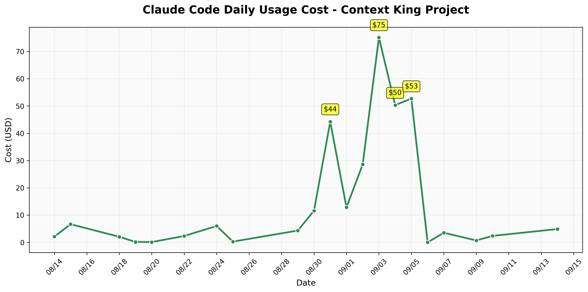

---

## Slide Title {.hscroll .scrollable}

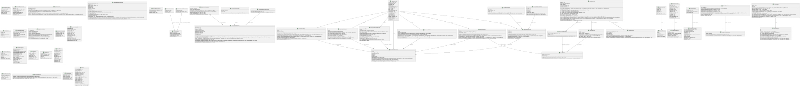{height=400px}

---

{fig-align="center"}

---

## You still need to spoonfeed when context is complex{.center}

- Incomplete searches. 
- Memory is sporadic and incomplete.
- Larger repos are harder to navigate with just agentic search.
- Can make huge changes based on partial information.
- Not good at knowing when it doesn't know enough. 


---

## And size isn't just increasing{.center}

- Gemini went from 2M to 1M tokens.

:::{.fragment}
- Llama-4 Scout (10M) is only 1M from third parties. Meta's version is 128k.
:::
:::{.fragment}
- Claude Sonnet 4 1M is nowhere in GA.
:::

---


# Back to the problem{.center}

---

## The Real Project: ESG Analysis {.center}

**Goal**: Extract ESG metrics from annual reports

**Problems we faced**:

- Bad ground truth datasets
- No standard ESG jargon across companies
- Traditional RAG kept missing critical information

<!-- **This led us to question**: *Do we even need RAG for this?* -->

---

## Methods to improve RAG

Endless list of options

:::: {.columns}

::: {.column width="50%"}
- Prompt engineering
- Query rewriting
- Query Expansion (HyDE)
- Hybrid search
- Reranking
- Agentic RAG
:::

::: {.column width="50%"}
- Change Embedding model
- Change LLM
- Chunking strategy
- Metadata filtering
- Multimodal RAG
- How to handle graphs and images?
:::

::::

---

## {.center}

```{=html}
<div style="text-align:center;">
<h3>When to use RAG</h3>
& 
<h3>When to use context window</h3>
</div>
```

---

## Outline {.center}

1. Section 1: Speed
2. Section 2: Quality
3. Section 3: RAG

---

## How does latency change with context window size{.center}


:::{.fragment style="text-align:center;"} 
"Quadratic scaling"
:::

---

## Luckily, it's much better than that. 

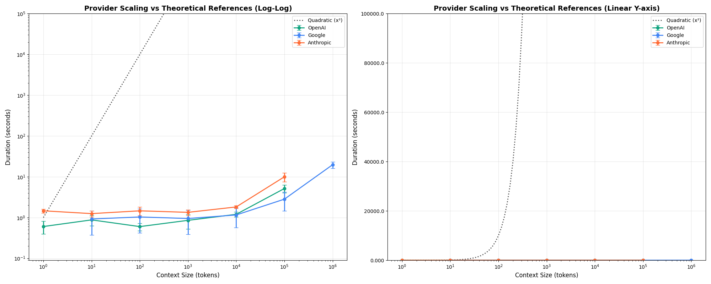

---

## Latency starts to rise after 10k tokens

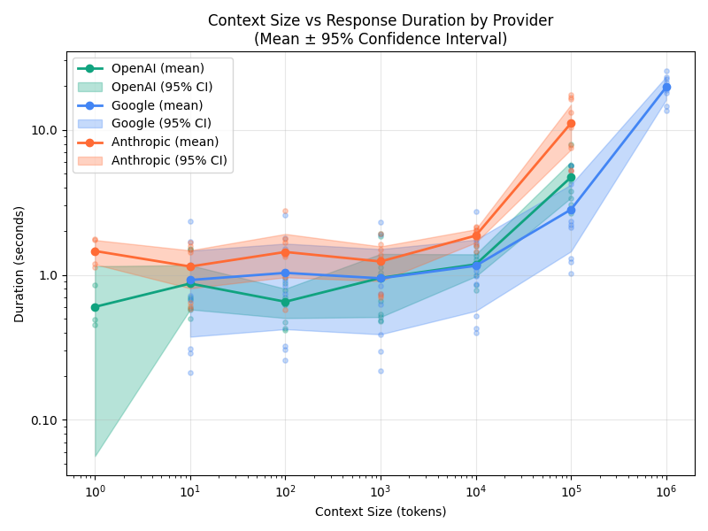{fig-align="center" width=90%}

```{=html}
<div style="text-align:center;">
100k-1M: increase between 4x and 10x.
</div>
```

--- 

## Token speed flattens

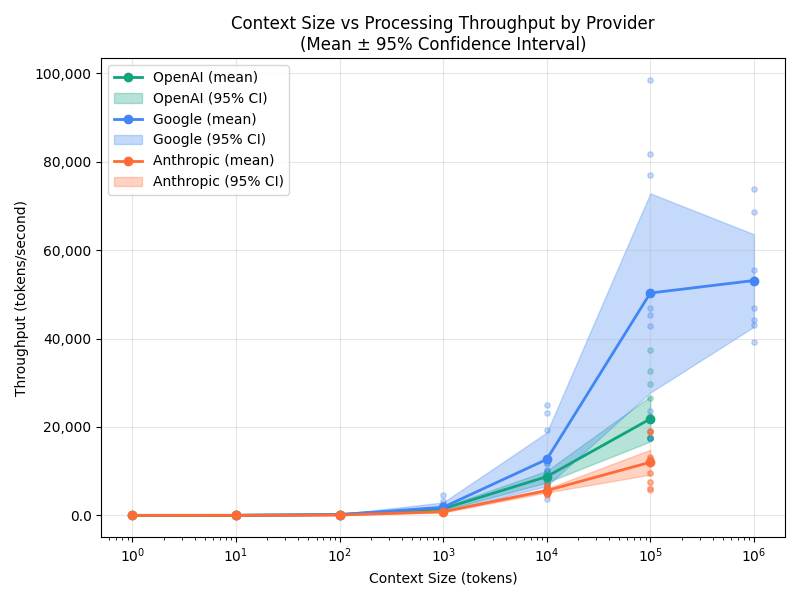{fig-align="center" width=90%}

---

## There is not no exponential relationship

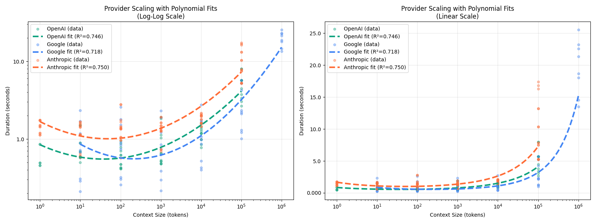

# Model speeds

---

## Google's beautiful three tier system 🔥{.center}

:::: {.columns}

::: {.column width="50%"}
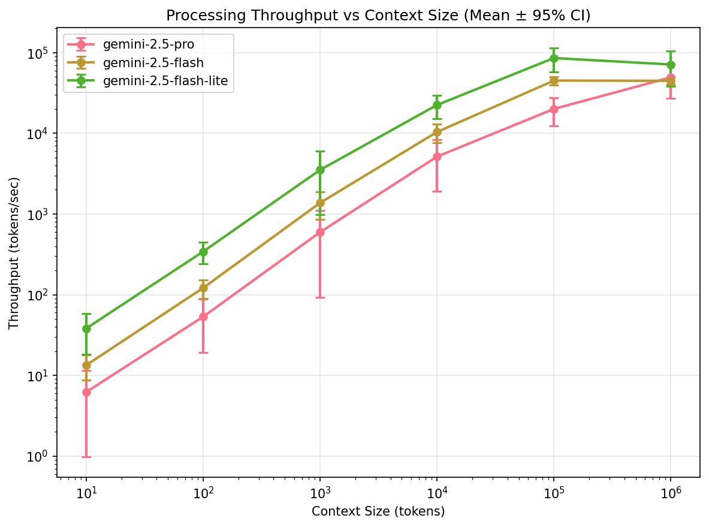{fig-align="center" }
:::

::: {.column width="50%"}
```{=html}
<div style="display: flex; flex-direction: column; justify-content: center; min-height:500px; height: 100%; align-items: flex-start;">
  <div style="margin-bottom: 1rem;">• Lighter models are faster</div>
  <div>• reliably scale to 1M</div>
</div>
```
:::

::::

---

## GPT & Claude do not have 3-tier system in speed

<!-- :::: {.columns}
::: {.column width='50%'} -->
::: {#fig-model-speeds layout-ncol=2}
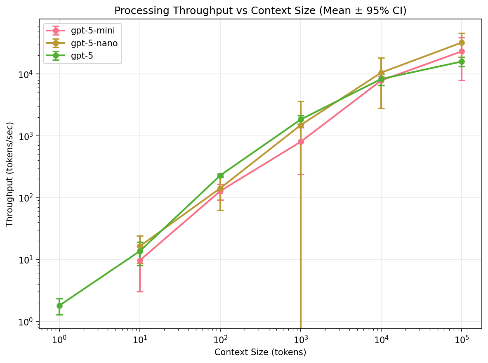{#fig-gpt}

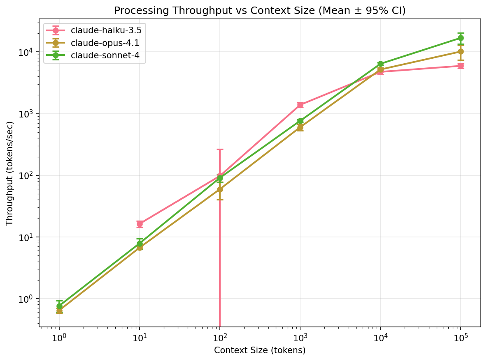{#fig-claude}
:::

---

## All together

:::: {.columns}

::: {.column width="50%"}
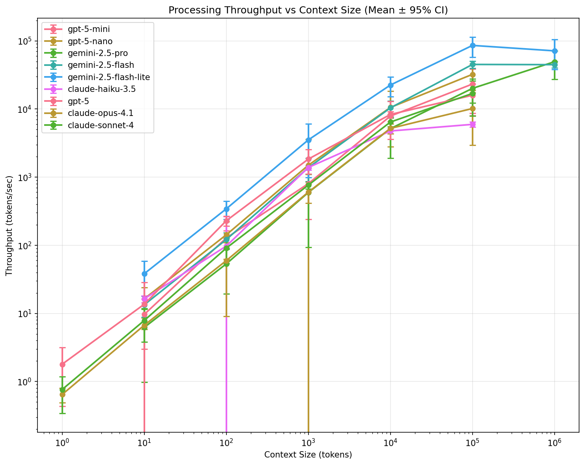{fig-align="center" }
:::

::: {.column width="50%"}
```{=html}
<div style="display: flex; flex-direction: column; justify-content: center; min-height:500px; height: 100%; align-items: flex-start;">
  <div style="margin-bottom: 1rem;">• Gemini flash-lite and flash are fastest, especially 100K+ tokens.</div>
  <div>• GPT-5 is 2nd up to 1k</div>
  <div>• Rest has no big distinction.</div>
</div>
```
:::

::::

---

## Takeaways


```{=html}
<div style="display: flex; flex-direction: column; justify-content: center; min-height:300px; height: 70%; align-items: flex-start;">
  <div>• Scaling beyond 100k tokens is costly</div>
  <div>• Gemini is often fastest.</div>
  <div>• While slower, scaling does much better than quadratic.</div>
</div>
```

# Context Windows

How well do they work?

---

## Needle-in-a-Haystack

- "Try to find the needle in the haystack"
- Put the answer to a question somewhere in a long text.
- Ask the llm to answer it. 

:::{.fragment .fade-in}
### Example

**Question**: What colour was the duck i had as a child?

**Needle**: The duck i had when i was 10 was orange. 
:::

---

## {background-image="img/niah_meta.png" background-size="contain"}

---

## How well do they work for non-trivial tasks?\*{.center}

---

## 


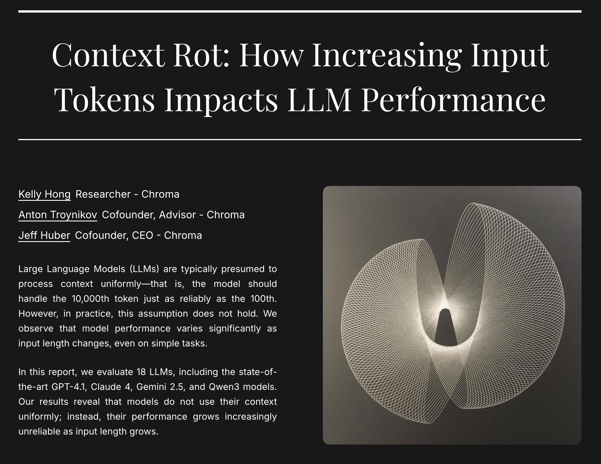{fig-align="center" .r-stretch}

---

## Experiment 1: Effect of similarity between needle and haystack

- NIAH benchmarks typically have high similarity

:::{.fragment}
- Many real world situations will **not** have high similarity
:::

---

## Experiment 1: Effect of similarity between needle and haystack

- Two groups of needles split on cosine similarity of embedding.
  - Similar to the query
  - Unsimilar to the query. 

---


## Experiment 1: Effect of similarity between needle and haystack

::: {.column-screen-inset style="display: flex; justify-content: center; align-items: center; height: 90%;"}
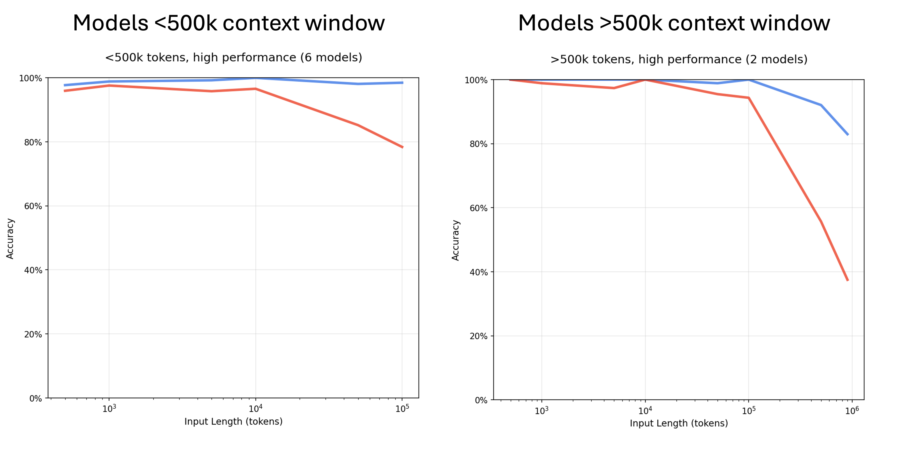{style="width: 80%; height: auto;" fig-align="center"}
:::

---

## Experiment 1: Takeaways {.center}

- Dissimilar question/answer pairs are challenging, especially after 100k tokens.
- Smaller models performs worse faster.

---

## Experiment 2: Impact of distractors


- Distractors are pieces of text similar to the needle (i.e. answer)
- Real world situations often have **many** distractors. 

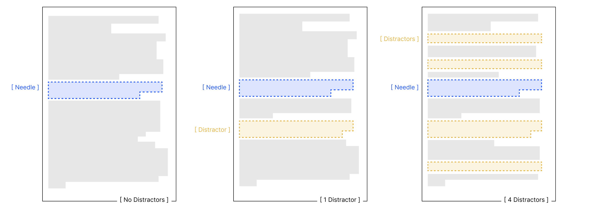


---

## Example

**Question**: What colour was the duck I had as a child?

**Needle**: The duck I had when I was 10 was orange. 

**Distractors**

- *My brother's duck was blue*

- *The duck I had as an adult was purple*

- *The childhood pig was pink*

---

## In context of a coding agent{.center}

Imagine the 10 different versions of your updated function in the context window. 

---

## So how did they do?

::: {.column-screen-inset style="display: flex; justify-content: center; align-items: center; height: 90%;"}
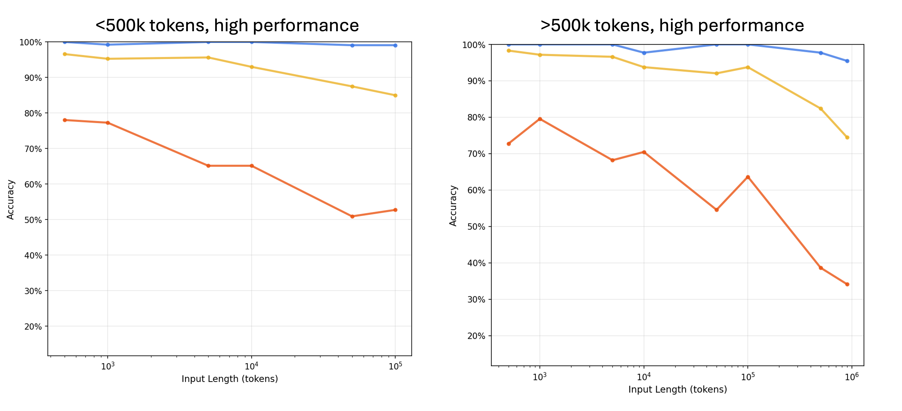{fig-align="center" style="z-index:-1; width: 90%; height: auto;"}
:::

```{=html}
<p style="text-align:center; margin-top:-50px">tldr; Line goes down</p>
```

<!-- --- -->
<!-- 
## Impact can be assessed per distractor

**Red** distractor is: "it was x but not anymore"

::: {.column-screen-inset style="display: flex; justify-content: center; align-items: center; height: 70vh;"}
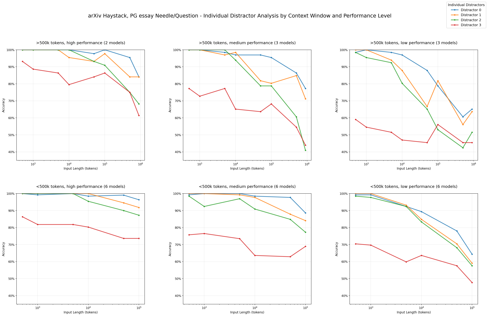{fig-align="center" height=550 style="z-index:-1"}
::: -->

<!-- ---

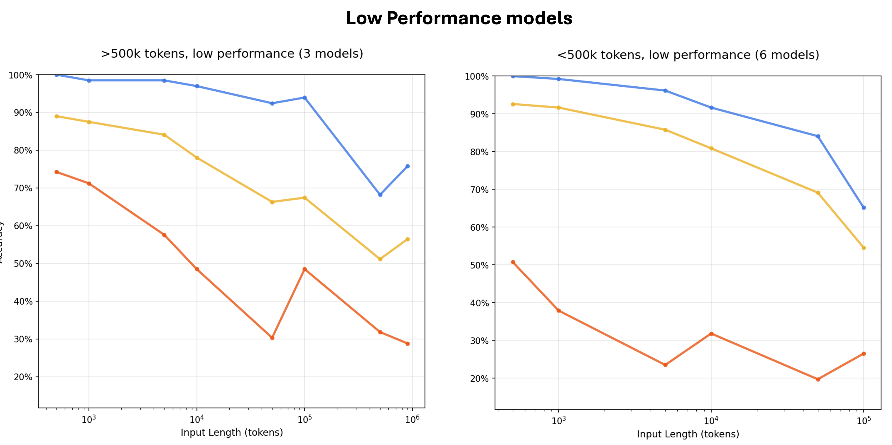

Models like gemini-flash-lite and gpt-nano. -->

---

## Claude hallucinates least

:::: {.columns}
::: {.column width="80%"}
{fig-align="center" height=500 style="z-index:-1"}
:::

::: {.column width="20%"}
```{=html}
<div style="display: flex; flex-direction: column; justify-content: center; min-height:500px; height: 100%; align-items: flex-start;">
  <div style="margin-bottom: 1rem;">Failure analysis of each model family</div>
</div>
```

:::
::::

--- 

## Takeaways{.center}

- Distractors are detrimental for all models
- Smaller models absolutely crumble
- More distractors worsen the effect

---

## Experiment 3: Long Conversational QA{.center}

How much worse do they answer with a lot of context? 

- **Context types**
  - Full context: *~113k tokens*
  - Focused context: *~300 tokens*


<!-- 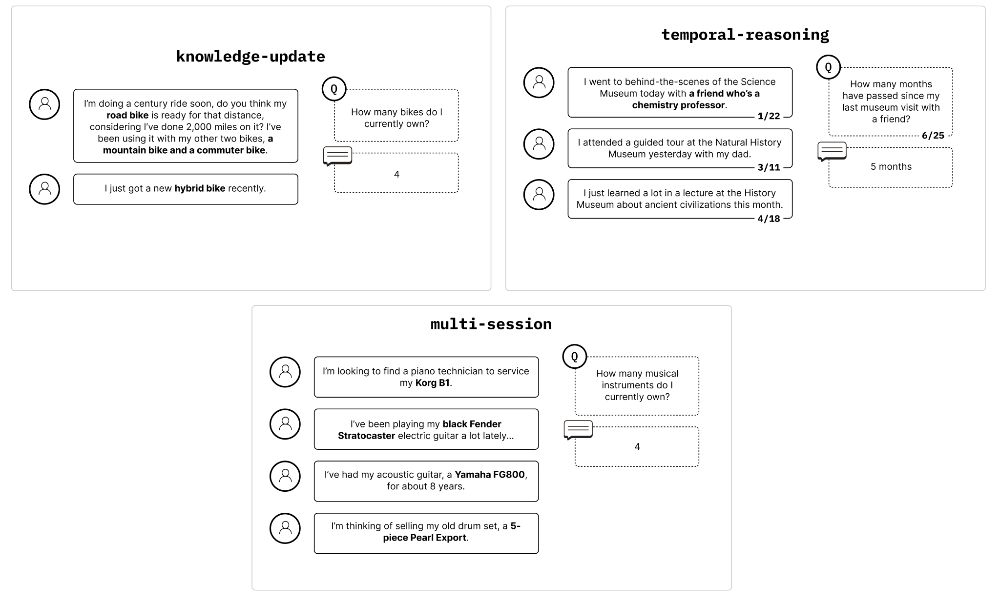{fig-align="center"} -->

---

## Claude refuses to answer when in doubt

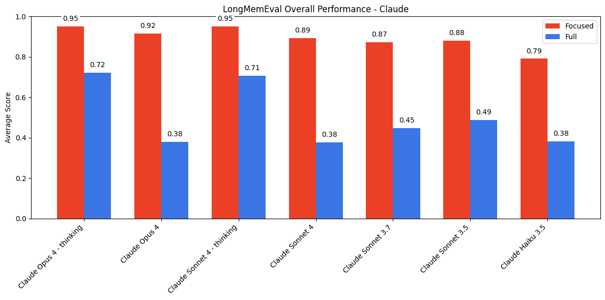{fig-align="center"}

Is this good or bad? 


---

## Gemini performs really well

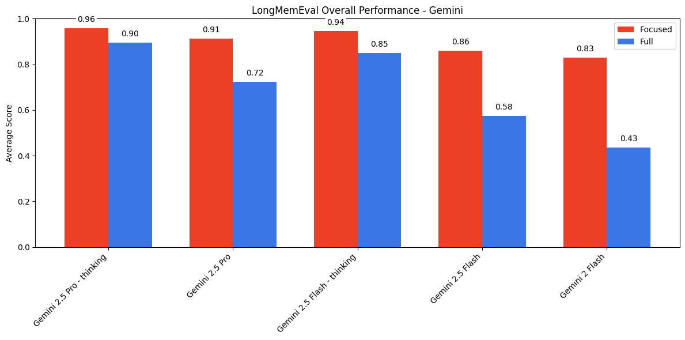

<!-- ---

## GPT is in the middle

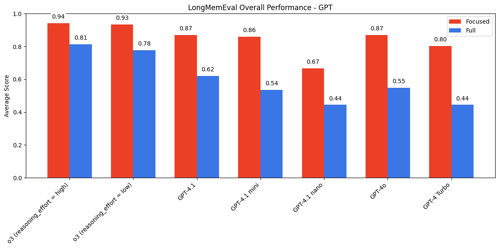 -->

---

## Takeaways {.center}

- Long context Q&A is very much unsolved.
- Reasoning helps a lot.
- Hallucination prevention can backfire

:::{.fragment}
Keep in mind, this was *"only"* ~113k tokens.
:::

<!-- ---

## Bonus Experiment: does shuffling context impact the performance? 

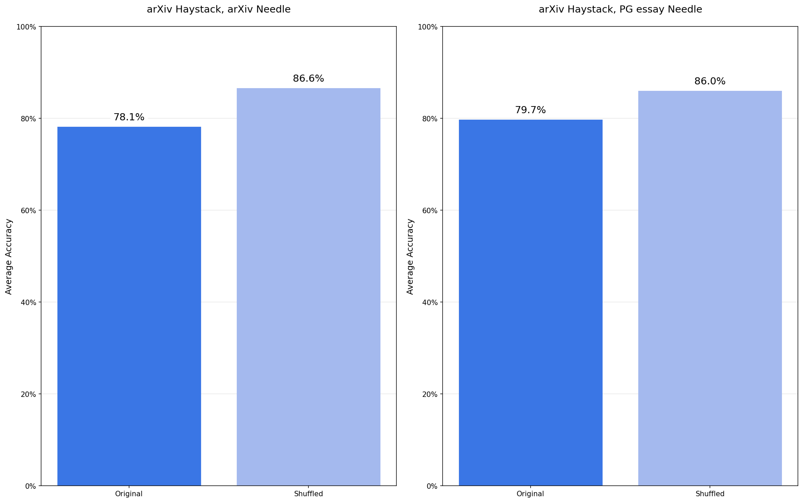 -->

---

# Impact of reranking {.center}

Does reranking still make sense with long context models?

---

## Experiment Setup

:::: {.columns style="display: flex; align-items: center; justify-content: center; min-height: 60vh;"}

::: {.column width="33%"}
<div style="
  border: 3px solid #1f77b4;
  border-radius: 12px;
  padding: 20px;
  margin: 10px;
  background: linear-gradient(135deg, #f8fbff 0%, #e3f2fd 100%);
  box-shadow: 0 4px 12px rgba(31, 119, 180, 0.15);
  text-align: center;
  height: 300px;
  display: flex;
  flex-direction: column;
  justify-content: center;
">
<h3 style="color: #1f77b4; margin-top: 0; font-weight: bold; font-size: 1.3em;">🔍 RAG Types</h3>
<div style="font-size: 1.1em; line-height: 1.4;">
<strong style="color: #2c5aa0;">- Basic RAG</strong><br/>
<strong style="color: #2c5aa0;">- Enhanced RAG</strong><br/>
<!-- <span style="color: #666; font-size: 0.9em;">(query rewrite, expansion)</span> -->
</div>
</div>
:::

::: {.column width="33%"}
<div style="
  border: 3px solid #2ca02c;
  border-radius: 12px;
  padding: 20px;
  margin: 10px;
  background: linear-gradient(135deg, #f8fff8 0%, #e8f5e8 100%);
  box-shadow: 0 4px 12px rgba(44, 160, 44, 0.15);
  text-align: center;
  height: 300px;
  display: flex;
  flex-direction: column;
  justify-content: center;
">
<h3 style="color: #2ca02c; margin-top: 0; font-weight: bold; font-size: 1.3em;">🔄 Reranking</h3>
<div style="font-size: 1.1em; line-height: 1.4;">
<strong style="color: #228b22;">✓ Yes</strong><br/>
<strong style="color: #228b22;">✗ No</strong>
</div>
</div>
:::

::: {.column width="33%"}
<div style="
  border: 3px solid #9467bd;
  border-radius: 12px;
  padding: 20px;
  margin: 10px;
  background: linear-gradient(135deg, #faf8ff 0%, #f0e6ff 100%);
  box-shadow: 0 4px 12px rgba(148, 103, 189, 0.15);
  text-align: center;
  height: 300px;
  display: flex;
  flex-direction: column;
  justify-content: center;
">
<h3 style="color: #9467bd; margin-top: 0; font-weight: bold; font-size: 1.3em;">📄 Baseline</h3>
<div style="font-size: 1.1em; line-height: 1.4;">
<strong style="color: #7b4397;">Full Context</strong><br/>
<span style="color: #666; font-size: 0.9em;">(no retrieval)</span>
</div>
</div>
:::

::::


<!-- --- -->
<!-- 
## Experiment Setup

 -->

---

## Experiment Setup{.center visibility="hidden"}

- Generated 200 questions from grouped chunks.
- Retrieve between **1-50** chunks.
- Each RAG query only searches in the **relevant document chunks**.
- Each run done 3 times.
- All run with gpt-4.1-mini and text-embedding-small [768]
- **\# Chunks per doc**: ~181
- **\# Tokens per doc**: ~27k
- **Total datapoints**: 35k

---

## Context window usage is limited

:::: {.columns}

::: {.column width="30%"}
```{=html}
<div style="display: flex; flex-direction: column; justify-content: center; min-height:500px; height: 100%; align-items: flex-start;font-size:0.8em;">
  <div style="margin-bottom: 1rem;">• 50 chunks uses 20k tokens. </div>
  <div style="margin-bottom: 1rem;">• 28k for full context.</div>
  <div style="margin-bottom: 1rem;">• ca. 40-50 pages</div>
</div>
```
:::

::: {.column width="70%"}
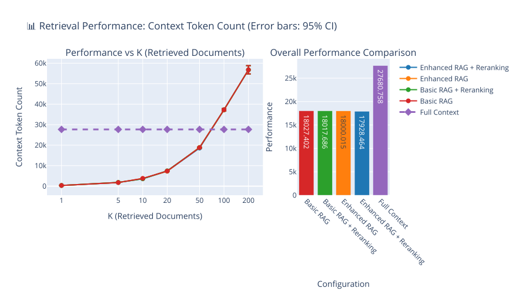{fig-align="center" style="z-index:-1; width: 100%; height: auto;"}
:::

:::: 


---

## Hit rate: was the correct chunk retrieved


:::: {.columns}

::: {.column width="20%"}
```{=html}
<div style="display: flex; flex-direction: column; justify-content: center; min-height:500px; height: 100%; align-items: flex-start;">
  <div style="margin-bottom: 1rem;font-size:0.8em;">More chunks == higher chance of the right chunk.</div>
</div>
```
:::

::: {.column width="80%"}
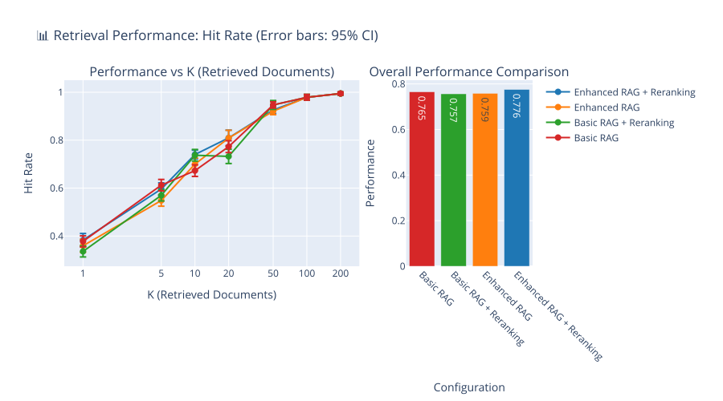{fig-align="center" style="z-index:-1; width: 100%; height: auto;"}
:::

:::: 

::: {.notes}
This is using openai text-embed-small with 768 dimensions, so room for improvement.
:::

---

## Correct Answer

:::: {.columns}


::: {.column width="20%"}
```{=html}
<div style="display: flex; flex-direction: column; justify-content: center; min-height:500px; height: 100%; align-items: flex-start;">
  <div style="margin-bottom: 1rem;font-size:0.8em">Converge on about 92% correct.</div>
</div>
```
:::

::: {.column width="80%"}
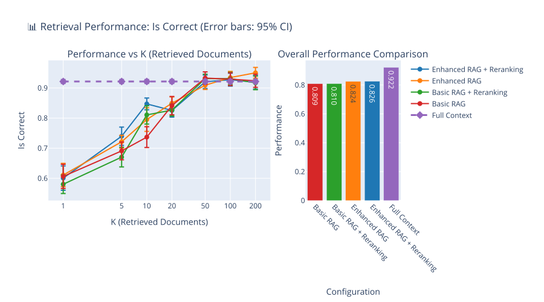{fig-align="center" style="z-index:-1; width: 100%; height: auto;"}
:::

:::: 

---

## So what's the effect of reranking?

On information retrieval metrics, a lot:

::: {#fig-model-speeds layout-ncol=2}
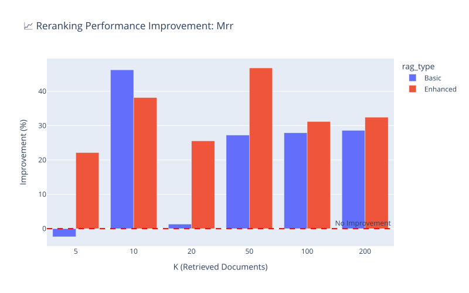{#fig-effectrecall}

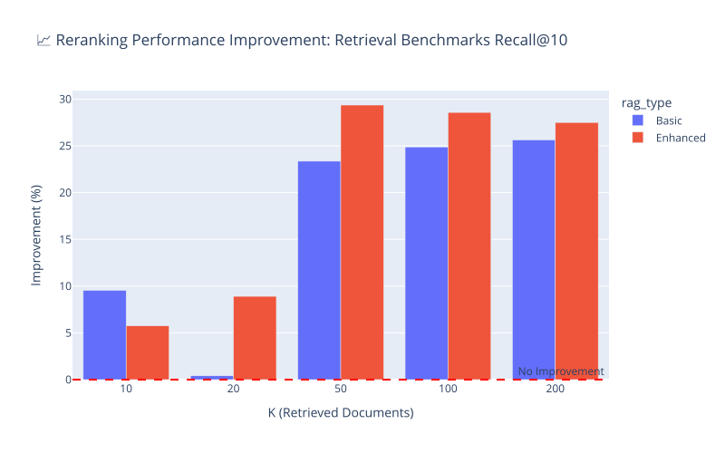{#fig-effectmrr}
:::

---

## For RAG, not so much. 

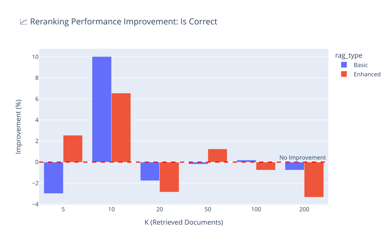{fig-align="center"}

```{=html}
<p style="text-align:center;">Strange outlier with k=10</p>
```

---

## RAG Performance

:::: {.columns}

::: {.column width="30%"}
```{=html}
<div style="display: flex; flex-direction: column; justify-content: center; min-height:500px; height: 100%; align-items: flex-start;font-size:0.8em">
  <div style="margin-bottom: 1rem;">• 50 Chunks saturates</div>
  <div>• Use-case dependent parameter</div>
  <div>• But that's 27% of total chunks per doc</div>
</div>
```
:::

::: {.column width="70%"}
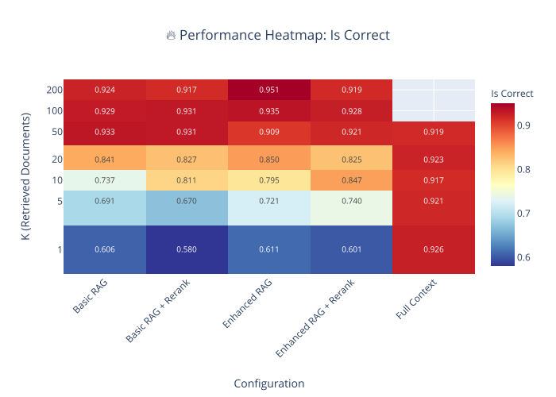{fig-align="center" style="z-index:-1; width: 90%; height: auto;margin-left:-100px;"}
:::

::::

---

## Speed Analysis


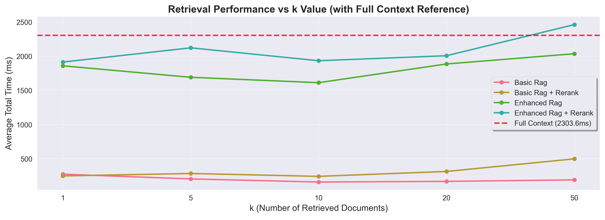{fig-align="center" style="z-index:-1; width: 90%; height: auto;margin-left:-100px;"}

```{=html}
<div style="text-align:center;">
  <p>For this size, speed is very comparable.</p>
  <p>More complex RAG will also be slower, but scales more linear.</p></div>
```
---

## Limitations

- **Limited Query complexity**: mostly single hop questions.
- No Reranking for filtering.
- Max # chunks was **339**, so more must be tested.
- Limited set of models.
- Only one embedding models.

---

## Takeaways{.center}

- You need a much higher K than you might think
- Result reranking does **not** have an effect with modern models

---

# Key Conclusions {.center}

---

## 1. How fast are LLMs? {.center}

:::{.fragment .fade-in}
**Scaling beyond 100k tokens gets expensive**
:::

:::{.fragment .fade-in}
- ~5s@100k, ~20s@1M
- 4x-10x latency increase from 100k to 1M tokens
- Gemini offers best speed at scale
- Better than quadratic, but still significant cost
:::

---

## 2. When to skip RAG entirely? {.center}

:::{.fragment .fade-in}
**Skip RAG when your domain fits in <100k tokens**
:::

:::{.fragment .fade-in}
- Performance degrades sharply after 100k tokens
- Distractors become increasingly problematic
- Speed is comparable between RAG and long context at this scale
:::

---

## 3. Where's the performance cliff? {.center}

:::{.fragment .fade-in}
**The 100k token threshold is real**
:::

:::{.fragment .fade-in}
- Long context Q&A is still very much unsolved
- Distractors are detrimental for all models
- Even at 113k tokens, performance varies dramatically
:::

---

## 4. Is reranking dead? {.center}

:::{.fragment .fade-in}
**Yes, reranking is dead for modern LLMs**
:::

:::{.fragment .fade-in}
- Retrieval metrics improve with reranking ✓
- **But actual answer quality doesn't** ✗
- Modern LLMs handle noisy context better than expected
:::

---

## 5. Is long context worth it? {.center}

:::{.fragment .fade-in}
**You need higher K than you think**
:::

:::{.fragment .fade-in}
- Performance saturates around 50 chunks (27% of document)
- Higher retrieval numbers compensate for embedding limitations
- Answer correctness matters more than precision at k=10
:::

---

## Your New RAG Decision Framework {.center}

:::: {.columns}

::: {.column width="50%"}
### When to Skip RAG ✅
- Domain <100k tokens
- Complex multi-hop queries
:::

::: {.column width="50%"}
### When to Use RAG 🤔
- Domain >100k tokens
- Use up to 50k context chunks
- Simple queries
:::
:::{style="text-align:center;" .fragment}
If it fits in context window, speed is likely comparable. 
:::
::::


---

## What You Should Do Monday {.center}

:::{.fragment .fade-in}
**1.** Audit your RAG pipeline - is your domain <100k tokens?
:::

:::{.fragment .fade-in}
**2.** Try context-only for small domains
:::

:::{.fragment .fade-in}
**3.** Experiment with 20-100 chunk retrieval for large domains
:::

:::{.fragment .fade-in}
**4.** Question your reranking steps - they might not help
:::


---

## I'll let me summarize it {.center}

---

## {background-video="img/cartoon_video.mp4"}


---

## Acknowledgments {.center}

:::{.fragment .fade-in}
**Sohrab & Tony** from **orq.ai** for providing unified LLM API access, observability and making this research possible.
:::

:::{.fragment .fade-in}
**Kelly Hong** from **Chroma** for her work on the Context Rot article.
:::

---

```{=html}
<div style="display: flex; justify-content: space-between; align-items: center; width: 100%; padding: 40px 0;">
  <!-- Left side: Contact info and headshot -->
  <div style="width: 60%; display: flex; flex-direction: column; align-items: center;">
    <div style="display: flex; align-items: center; margin-bottom: 30px;">
      
      <div>
        <h3 style="color: #2aa198; margin: 0; font-size: 1.8em;">Bauke Brenninkmeijer</h3>
        <p style="color: #93a1a1; margin: 5px 0; font-size: 1.1em;">Research Engineer @ orq.ai</p>
      </div>
    </div>

    <div style="display: grid; grid-template-columns: 1fr 1fr; gap: 20px; width: 100%;">
      <div style="background: linear-gradient(135deg, #073642, #002b36); border-radius: 10px; padding: 15px; text-align: center;">
        <div style="font-size: 2em; margin-bottom: 8px;">✉️</div>
        <p style="color: #2aa198; font-weight: bold; margin: 0;">Email</p>
        <p style="color: #abb5b5ff; font-size: 0.9em; margin: 5px 0;">bauke.brenninkmeijer@orq.ai</p>
      </div>

      <div style="background: linear-gradient(135deg, #073642, #002b36); border-radius: 10px; padding: 15px; text-align: center;">
        <div style="font-size: 2em; margin-bottom: 8px;">🚀</div>
        <p style="color: #2aa198; font-weight: bold; margin: 0;">orq.ai</p>
        <p style="color: #abb5b5ff; font-size: 0.9em; margin: 5px 0;">Check out our platform</p>
      </div>
    </div>

    <!-- <div style="margin-top: 30px; padding: 20px; background: rgba(42, 161, 152, 0.1); border-radius: 10px; border-left: 4px solid #2aa198; width: 100%;">
      <p style="color: #2aa198; font-weight: bold; margin: 0; text-align: center; font-size: 1.1em;">
        🎯 Available for consulting & speaking engagements
      </p>
      <p style="color: #93a1a1; margin: 10px 0 0 0; text-align: center;">
        RAG optimization • Long context strategies • AI implementation
      </p>
    </div> -->
  </div>

  <!-- Right side: QR Code -->
  <div style="width: 35%; display: flex; flex-direction: column; align-items: center;">
    <div style="background: white; padding: 20px; border-radius: 15px; box-shadow: 0 6px 15px rgba(0,0,0,0.3);">
```

```{python}
import segno
# Let Segno choose the minimal version and an optimal (maximal) error
# level without changing the minimal version
qrcode = segno.make('https://www.linkedin.com/in/bauke-brenninkmeijer-40143310b/')
qrcode.designator
'2-Q'
qrcode.save('linkedin_qr_code.png', scale=10)
```

```{=html}
    
    </div>
    <p style="color: #2aa198; font-weight: bold; margin-top: 15px; text-align: center; font-size: 1.1em;">
      Scan to connect on LinkedIn
    </p>
    <p style="color: #93a1a1; font-size: 0.9em; text-align: center; margin: 5px 0;">
      Let's discuss your RAG challenges!
    </p>
  </div>
</div>
```
<!-- 
:::{.fragment .fade-in style="text-align: center; margin-top: 30px;"}
```{=html}
<p style="color: #268bd2; font-size: 1.4em; font-weight: bold;">
  Thank you for your attention! 🙏
</p>
<p style="color: #93a1a1; font-size: 1em;">
  Questions? Let's chat during the break or find me at the orq.ai booth!
</p>
``` -->
<!-- ::: -->
